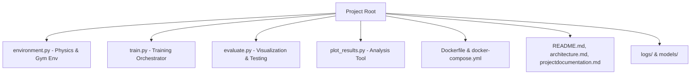
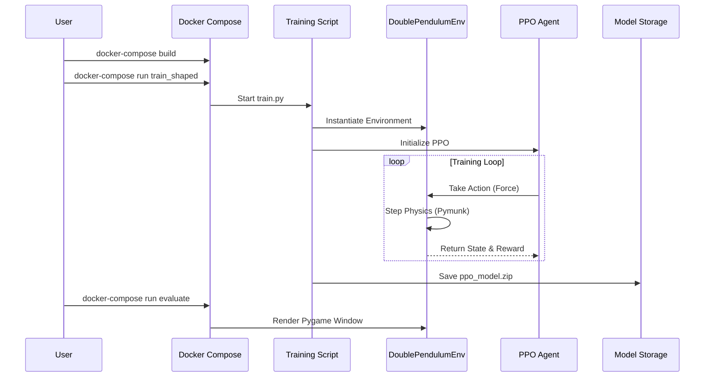

# 🚀 Double Inverted Pendulum RL: Mastering Physics with PPO

<div align="center">


**A high-performance, 2D physics-based control environment built from scratch.**

[Explore Architecture](architecture.md) • [View Documentation](projectdocumentation.md) • [Report Bug](https://github.com/your-repo/issues)

</div>

---

## 📖 Project Overview

The Double Inverted Pendulum is a classic control theory challenge. Unlike the standard CartPole, this system features two interconnected poles, making it significantly more complex and unstable. The agent must learn to apply precise horizontal forces to a cart to keep both poles balanced vertically.

### 🌟 Key Features
- **Custom Physics**: Built using `pymunk` for rigid-body dynamics.
- **Real-time Rendering**: Visualized with `pygame`.
- **Advanced RL**: Powered by `stable-baselines3` PPO implementation.
- **Reward Shaping**: Comparative analysis between sparse baseline and dense shaped rewards.
- **Full Containerization**: One-command setup with Docker.

---

## 🛠 Tech Stack

| Component | Technology | Role |
|-----------|------------|------|
| **Language** | Python 3.9 | Core Logic |
| **Physics** | Pymunk | Rigid-body simulation |
| **RL Framework** | Stable-Baselines3 | PPO Algorithm |
| **Deep Learning** | PyTorch | Neural Network Backend |
| **Visualization** | Pygame | GUI & Rendering |
| **Data Analysis** | Pandas & Matplotlib | Metrics & Plotting |
| **DevOps** | Docker & Compose | Environment Isolation |

---

## 📐 Code Structure



---

## 🔄 Execution Flow



---

## 🚀 Setup & Installation

### 1. Prerequisites
- **Docker**: [Download here](https://www.docker.com/get-started)
- **Docker Compose**: [Install guide](https://docs.docker.com/compose/install/)
- **X-Server** (Optional, for GUI visualization):
    - **macOS**: [XQuartz](https://www.xquartz.org/)
    - **Windows**: [VcXsrv](https://sourceforge.net/projects/vcxsrv/)

### 2. Local Installation
```bash
# Clone the repository
git clone <repository-url>
cd double-pendulum-rl

# Build the container
docker-compose build
```

---

## 🎮 Usage Instructions

### 🏋️ Training
Train the agent with the **Shaped Reward** (recommended for faster convergence):
```bash
docker-compose run train_shaped
```
To train with the **Baseline Reward**:
```bash
docker-compose run train_baseline
```

### 👁️ Evaluation
Visualize the trained agent's performance in real-time:
```bash
docker-compose run evaluate
```

### 📈 Analysis
Generate the learning curve comparison plot:
```bash
docker-compose run plot
```

---

### Environment Design
The environment is built using **Pymunk**, a 2D physics engine. It simulates a cart on a horizontal track with two poles connected in series.
- **Cart**: A rectangular body constrained to a 1D groove joint.
- **Poles**: Two segments connected by pivot joints.
- **Observation Space**: A 6D vector containing `[cart_x, cart_v, theta1, omega1, theta2, omega2]`.
- **Action Space**: A continuous value representing the horizontal force applied to the cart.

### Reward Function Design
We implemented two distinct reward strategies to evaluate learning efficiency:

1. **Baseline Reward**:
   - **Formulation**: $R = \cos(\theta_1) + \cos(\theta_2)$
   - **Rationale**: Encourages the poles to stay as close to the vertical (0 radians) as possible. It is a sparse signal that only rewards the final objective.

2. **Shaped Reward**:
   - **Formulation**: $R_{baseline} - 0.1 \cdot |x_{cart}| - 0.01 \cdot (|\omega_1| + |\omega_2|) - 0.001 \cdot a^2$
   - **Rationale**: 
     - **Center Penalty**: Keeps the cart from drifting off the track.
     - **Velocity Penalty**: Dampens wild oscillations for smoother control.
     - **Action Penalty**: Encourages energy-efficient movements.

### How to Run
1. **Build the Image**:
   ```bash
   docker-compose build
   ```
2. **Train the Agent**:
   - For shaped reward: `docker-compose run train_shaped`
   - For baseline reward: `docker-compose run train_baseline`
3. **Evaluate & Visualize**:
   ```bash
   docker-compose run evaluate
   ```
4. **Generate Plots**:
   ```bash
   docker-compose run plot
   ```

---

## 📊 Results & Analysis
The project demonstrates that **Reward Shaping** is critical for complex control. By providing intermediate feedback (penalizing high velocities and drift), the agent masters the balance significantly faster than with a sparse baseline reward.

Check `reward_comparison.png` for the full learning curve analysis.

---

## 🛡️ Testing Strategy
We use a comprehensive testing approach to ensure stability:
- **Environment Unit Tests**: Validating physics stepping and observation bounds.
- **Integration Tests**: Ensuring the agent-environment loop functions without crashes.
- **Performance Benchmarking**: Comparing convergence rates across different reward functions.

---

<div align="center">
Developed with ❤️ for the RL Community
</div>
