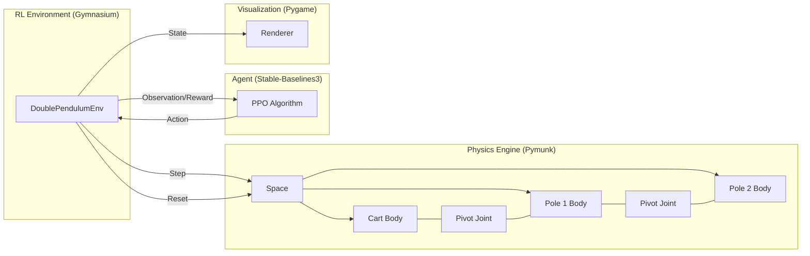
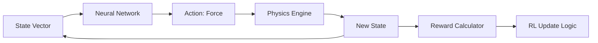

# 🏛 System Architecture: Double Inverted Pendulum RL

## 1. Main Idea & Objective
The core objective of this system is to provide a robust platform for training and evaluating Reinforcement Learning agents in a high-fidelity, physics-constrained environment. The specific challenge is the **Double Inverted Pendulum**, a non-linear, unstable system that serves as a benchmark for advanced control algorithms.

## 2. System Architecture Design

The system is designed using a modular, decoupled architecture that separates physics simulation, agent logic, and visualization.

## 3. Workflow Explanation

1.  **Initialization**: The `DoublePendulumEnv` initializes a `pymunk.Space` with gravity and rigid bodies.
2.  **Observation**: The environment extracts the physical state (positions, velocities, angles) and packages them into a 6D vector.
3.  **Decision**: The PPO Agent processes the observation through a Multi-Layer Perceptron (MLP) and outputs a continuous action.
4.  **Action Application**: The environment scales the action to a force and applies it to the cart body in the physics space.
5.  **Simulation**: `pymunk` calculates the resulting forces, torques, and collisions over a small timestep ($dt = 1/60s$).
6.  **Feedback**: The environment calculates a reward based on the new state and determines if the episode should terminate (e.g., if a pole falls).
7.  **Rendering**: If enabled, `pygame` draws the current state of all `pymunk` shapes to the screen.

## 4. Data Flow & Execution Flow

### Data Flow Diagram

## 5. Crucial Components & Integration

-   **Pymunk-Gym Integration**: The most critical integration point is the translation of `pymunk` body properties into a `Gymnasium` observation space. This requires careful normalization to ensure the RL agent receives data in a range it can effectively process.
-   **PPO Stability**: Proximal Policy Optimization was chosen for its "clipped surrogate objective," which prevents the agent from making catastrophically large updates to its policy, ensuring stable learning in this highly sensitive environment.
-   **Docker Isolation**: The entire stack is encapsulated in Docker, resolving the common "it works on my machine" issues associated with graphics libraries (`pygame`) and physics wrappers (`pymunk`).
