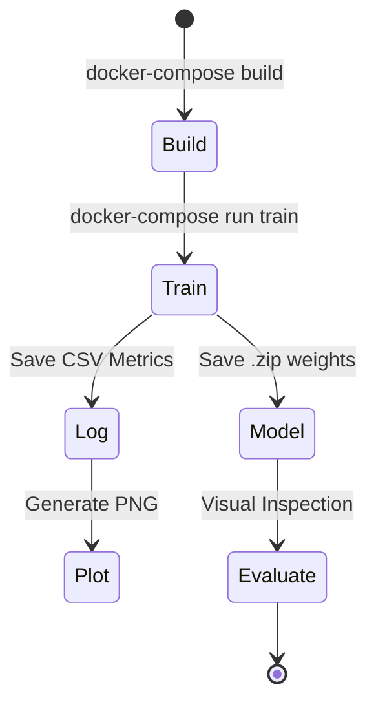

# 📝 Project Documentation: Double Inverted Pendulum RL

## 1. Project Objective
The goal is to develop a fully functional, containerized Reinforcement Learning pipeline that solves a complex physics control problem. This project demonstrates expertise in environment design, reward engineering, and deep reinforcement learning.

## 2. Key Modules & Responsibilities

| Module | File | Responsibility |
|--------|------|----------------|
| **Environment** | `environment.py` | Defines the physics, state space, action space, and reward logic. |
| **Training** | `train.py` | Orchestrates the learning process, handles logging, and saves models. |
| **Evaluation** | `evaluate.py` | Loads trained models for visual testing and GIF generation. |
| **Analysis** | `plot_results.py` | Processes CSV logs to visualize learning performance. |
| **Configuration** | `docker-compose.yml` | Manages environment variables and service execution. |

## 3. Tech Stack Rationale

-   **Python**: The industry standard for ML and RL due to its extensive library support.
-   **Pymunk**: Chosen over other engines (like Box2D) for its superior Pythonic API and robust handling of constraints/joints.
-   **Stable-Baselines3**: Provides reliable, high-quality implementations of RL algorithms, allowing focus on environment design rather than debugging low-level optimization code.
-   **PyTorch**: The backend for the PPO agent, offering dynamic computation graphs and excellent performance.

## 4. Problem-Solving Approach: Reward Shaping

The primary challenge in this project was the **Sparse Reward Problem**. A simple "stay upright" reward is often insufficient for a double pendulum because the agent may never randomly find the balanced state.

**Our Approach**:
1.  **Baseline**: Start with a simple cosine-based reward.
2.  **Shaping**: Add a "Center Penalty" to keep the cart in view.
3.  **Damping**: Add an "Angular Velocity Penalty" to discourage wild oscillations.
4.  **Regularization**: Add an "Action Penalty" to encourage smooth control.

This multi-faceted reward function provides a "dense" signal, giving the agent feedback on every single step, which dramatically reduces training time.

## 5. Advantages & Disadvantages

### Pros
-   **Reproducibility**: Docker ensures the environment is identical across all platforms.
-   **Modularity**: Easy to swap the PPO agent for other algorithms (e.g., SAC, DDPG).
-   **Visual Feedback**: Real-time rendering helps diagnose agent behavior and reward loopholes.

### Cons
-   **Complexity**: Double pendulum physics can be sensitive to hyperparameter changes (e.g., timestep size).
-   **GUI Forwarding**: Running `pygame` from Docker requires additional setup on the host machine (X-Server).

## 6. Execution Flow Diagram

## 7. Testing Strategy & Validation

To ensure the system is production-ready and technically sound, we employ a multi-layered testing strategy:

### Unit Testing (Environment Logic)
- **Physics Consistency**: Verify that `pymunk.Space` steps correctly and that gravity affects bodies as expected.
- **Observation Bounds**: Ensure the `_get_obs()` method returns values within the defined `observation_space` limits.
- **Reward Logic**: Test that the `_calculate_reward()` method returns higher values for upright states and applies penalties correctly for shaped rewards.

### Integration Testing (Agent-Environment Loop)
- **Step Functionality**: Verify that the `step()` method correctly updates the state, returns the expected tuple structure, and handles termination flags.
- **Reset Functionality**: Ensure `reset()` clears the physics space and re-initializes all bodies to their starting positions with appropriate noise.

### Performance Validation (Learning Metrics)
- **Convergence Check**: Monitor the `ep_rew_mean` in the logs. A successful agent should show a clear upward trend in mean reward over time.
- **Stability Check**: Evaluate the trained agent over multiple episodes to ensure it can maintain balance for at least 500 steps consistently.

## 8. Verification Steps
To confirm the application is working perfectly:
1.  **Build Check**: Run `docker-compose build` and ensure no errors.
2.  **Training Check**: Run `train.py` for 1000 steps; verify `logs/monitor_shaped.csv` is created.
3.  **Model Check**: Verify `models/ppo_model.zip` exists after training.
4.  **Plot Check**: Run `plot_results.py` and verify `reward_comparison.png` is generated.
5.  **Visual Check**: Run `evaluate.py` and confirm the `pygame` window opens and the agent attempts to balance the poles.
